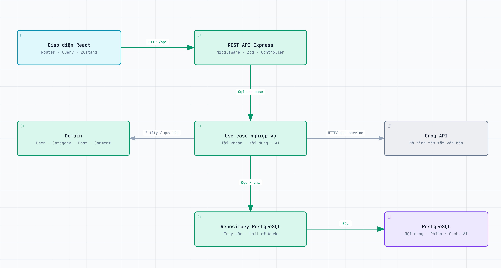
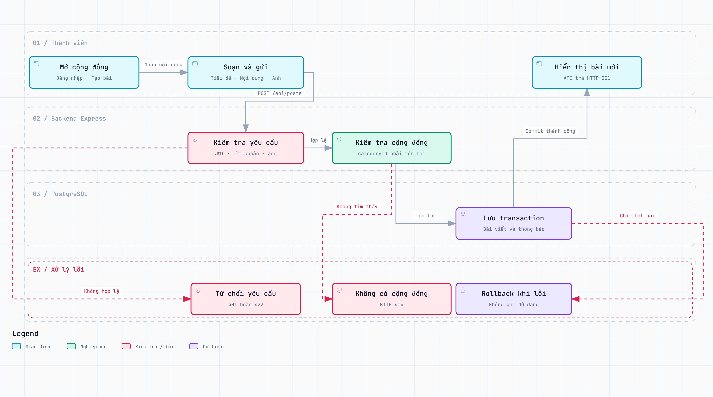
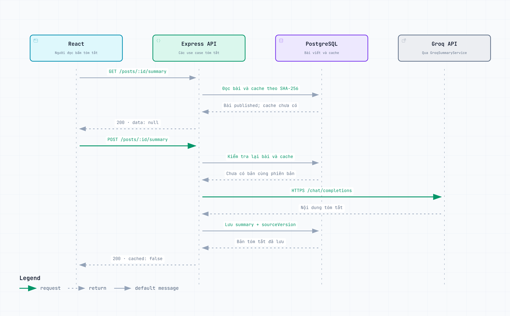

# Sơ đồ hệ thống VRUM

Ba sơ đồ được đối chiếu với [mã nguồn e899ec3](https://github.com/haidangZ005/VRUM-member-community-website/tree/e899ec3c73994d41971b276ad8d221a4c85c34fe) ngày 15/09/2026, tạo bằng Archify. Ảnh PNG bên dưới dùng **light theme**, có thể xem trực tiếp trên GitHub; bấm ảnh để phóng to.

Để dùng bản tương tác, tải thư mục này cùng các file HTML, mở **index.html** rồi chọn sơ đồ. Trang mở sơ đồ với `?theme=light`. Mỗi HTML chứa đầy đủ nội dung và tài nguyên cần thiết; không cần chạy ứng dụng VRUM. Nút điều khiển của Archify dùng tiếng Anh.

## Architecture

Luồng chính: React → REST API Express → use case → repository → PostgreSQL. Domain chứa entity và quy tắc nghiệp vụ; GroqSummaryService gọi dịch vụ AI từ backend. Đây là sơ đồ thành phần và quan hệ xử lý, không phải bản đồ hạ tầng production.

[](architecture.png)

[HTML tương tác](architecture.html) · [SVG](architecture.svg) · [Nguồn JSON](architecture.json)

## Workflow

Quy trình đăng bài trong cộng đồng: soạn bài, xác thực và validation, kiểm tra cộng đồng, lưu bài cùng thông báo trong transaction và trả kết quả. Các nhánh lỗi thể hiện từ chối yêu cầu, cộng đồng không tồn tại hoặc rollback.

[](workflow.png)

[HTML tương tác](workflow.html) · [SVG](workflow.svg) · [Nguồn JSON](workflow.json)

## Sequence

Luồng tóm tắt AI khi chưa có cache hợp lệ: frontend đọc cache bằng GET, gửi POST nếu chưa có, backend kiểm tra lại rồi gọi Groq và lưu kết quả. Khi cache còn đúng phiên bản, không cần gọi mô hình. Các đường dẫn bài viết trong hình có tiền tố `/api`.

[](sequence.png)

[HTML tương tác](sequence.html) · [SVG](sequence.svg) · [Nguồn JSON](sequence.json)

## Đối chiếu mã nguồn

| Sơ đồ | Thành phần được đối chiếu |
| --- | --- |
| Architecture | `frontend/src/app/routes/AppRoutes.jsx`, `backend/src/main/factories/makeDependencies.js`, `backend/src/main/factories/makeUseCases.js` |
| Workflow | `backend/src/interfaces/http/routes/postRoutes.js`, `backend/src/application/use-cases/posts/CreatePost.js`, `backend/src/infrastructure/database/postgres/PostgresUnitOfWork.js` |
| Sequence | `frontend/src/features/posts/hooks/usePosts.js`, `backend/src/application/use-cases/posts/GetPostSummary.js`, `backend/src/application/use-cases/posts/SummarizePost.js`, `backend/src/infrastructure/services/GroqSummaryService.js` |

## Kiểm tra

Mỗi HTML đạt 9/9 kiểm tra showcase, không có lỗi hoặc cảnh báo bố cục. Kiểm tra tự động trên Brave bao phủ 1440×900, 1600×1000, 1920×1080 và 2048×1320. Thông tin xác minh và SHA-256 nằm trong [verification.json](verification.json).

Các bản PNG/SVG được xuất từ menu Export của HTML đã kiểm định. Bản dùng trong báo cáo Word tăng cỡ chữ để đọc trên trang A4 nằm ngang, giữ nguyên các thành phần và quan hệ.

## Tạo lại bằng Archify

```powershell
node "$env:USERPROFILE/.codex/skills/archify/bin/archify.mjs" validate architecture docs/diagrams/architecture.json --quality showcase --json
node "$env:USERPROFILE/.codex/skills/archify/bin/archify.mjs" deliver architecture docs/diagrams/architecture.json docs/diagrams/architecture.html --quality showcase --json
```

Thay `architecture` bằng `workflow` hoặc `sequence` cho hai sơ đồ còn lại.
